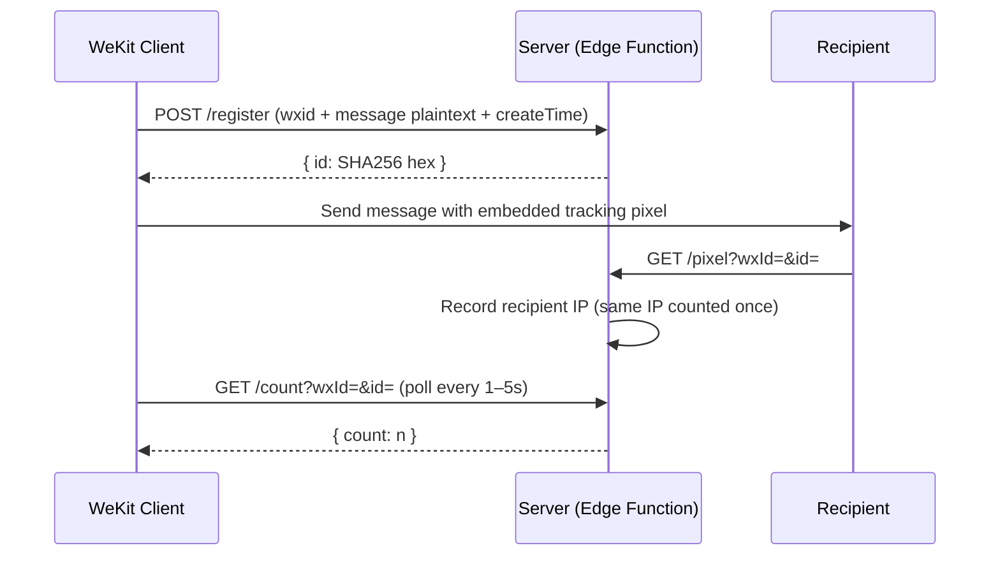

# Read Receipts Server (EdgeOne Edition)

[](LICENSE)
[](https://edgeone.ai)

**English** · [中文](README.md)

A message read-receipt tracking service built on **EdgeOne Makers (Edge Functions + KV Storage)**. It is a port of
[wekit-read-receipts-cf-workers](https://github.com/lie-jiu/wekit-read-receipts-cf-workers)
(Cloudflare Workers + D1). A 1×1 transparent tracking pixel is embedded in messages; when a recipient opens the message the service records their IP and returns a deduplicated read count. Ships with a dark-themed dashboard, multi-user data isolation and an admin panel. API surface and behavior match the original.

> [!WARNING]
> **Privacy notice**: This service records recipients' IP addresses and precise open timestamps without their knowledge. In China this falls under the Personal Information Protection Law (PIPL) — inform recipients before tracking and consider data minimization (clear data via the admin panel when done). Third-party tracking like this is prohibited by WeChat's terms of service; your account may be at risk.

## Quick Start

See [Deployment](#deployment). Once deployed, open your preview URL and register an account. For invite codes and admin access, see [Environment Variables](#environment-variables).

> [!IMPORTANT]
> Edge Functions rely on KV Storage — **you must apply for and bind a KV namespace in the console before the first deployment** (see [Deployment](#deployment)), otherwise endpoints return 500.

## How It Works



## Features

- **Multi-user isolation** — wxid is the account; password login; each user only sees their own messages
- **Level quotas** — level N keeps N messages × N months (max 99); level 0 = ban, immediately wipes the account's data
- **Invite codes & admin** — optional `INVITE_CODE` gates registration; `ADMIN` accounts can access `/admin`
- **Deterministic IDs** — message ID = `SHA256(wxId + \0 + content + \0 + createTime)`, computed independently and identically by client and server
- **IP dedup** — the same IP opening multiple times counts once; the read count is derived directly from the dedup mark keys, always consistent with the read-details list (no single-key counter, avoiding lost updates under KV eventual consistency)
- **Dashboard** — dark theme, responsive, Chinese/English i18n, search, filtering, expandable read details, password change
- **Leaderboard** — three boards (registration / reads / per-message reads), each switchable between daily and all-time; counts "cumulative events", unaffected by quota cleanup and unaffected when users clear their own messages; top 10 only; wxid masked server-side, message content masked too (first/last 2 chars, full text if under 5 chars); self (or own messages) highlighted; daily scope uses China Standard Time (UTC+8) calendar days; **known limitation**: under a burst of concurrent new readers the stats keys may undercount due to KV read-modify-write races (fine for non-real-time use; read details are unaffected)
- **Serverless, zero cost** — runs on the EdgeOne edge network; KV free tier 1 GB

## Differences from the Cloudflare Original

| Item | Original (CF Workers + D1) | This version (EdgeOne Edge Functions + KV) |
|------|---------------------------|---------------------------------------------|
| Storage | D1 (SQLite, strong consistency) | KV (global variable, eventual consistency ≤60s) |
| Read count | D1 atomic `UPDATE ... SET count=count+1` | Derived from `r_` dedup mark keys (KV single-key counters suffer lost updates; `rc_` retired) |
| Dedup | `reads(id, ip)` unique index, atomic `INSERT OR IGNORE` | Check-then-write dedup mark; tiny probability of duplicate counts |
| Stale-read cleanup | Quota cleanup also deletes expired reads on surviving messages (by wx_id + time) | Dedup mark keys carry no wx_id, so reads are only removed together with their whole message; expired reads on surviving messages are kept (only affects stale read counts of surviving messages — negligible) |
| Rate limiting | Workers Cache API | EdgeOne Cache API (`caches.open`), edge-based too |
| Client IP | `CF-Connecting-IP` | `request.eo.clientIp` |
| Scheduled cleanup (cron) | Workers built-in cron `0 3 * * *` | No timer: admin-triggered `POST /admin/cleanup` instead |
| Environment variables | `wrangler` secret | Console environment variables (`context.env`) |
| Deployment | `npx wrangler deploy` | `edgeone makers deploy` |

## Client Integration

The service is called by the WeKit client module (third-party, immutable) which uses these three **unauthenticated** endpoints directly, relying only on the precondition that "the wxid belongs to a registered account":

| Endpoint | Purpose |
|----------|---------|
| `POST /register` | Submit message plaintext when sending (wxid + content + createTime) |
| `GET /count` | Poll every 1–5 seconds for each message on screen |
| `GET /pixel` | Loaded when a recipient opens a message |

Please note:

- **The invite code only gates account registration** (`/auth/register`), not message registration. Anyone who knows a user's wxid can register messages for that account (bounded by the 30/min per-IP rate limit)
- Level quotas use lazy cleanup that deletes the oldest excess messages: it triggers when registering a new message or viewing messages/read counts; registering N+1 messages in a row for a wxid can wipe all of its messages (N ≤ 99). Use it only within a trusted circle and make good use of the `ADMIN` account
- The server receives message plaintext (needed to match read records) — this is inherent to the design

## Accounts & Levels

- **Register**: visit the login page → switch to "Register" → fill in wxid + password (≥8 chars) + invite code → auto-login. Admins can also create accounts directly in `/admin` (wxid + password, default level 1, uniqueness check only)
- **Login**: wxid + password → `POST /auth/verify` → sets `__Host-session` cookie (HttpOnly, Secure, SameSite=Lax, 30 days) → redirect to `/`. Admins must visit `/admin` to enter the panel
- **Sessions**: only the SHA-256 hash of the session ID is stored server-side; the cookie never contains the password
- **Data isolation**: all `/messages*` and `/reads/*` endpoints are locked to the currently logged-in wxid; `/count` and `/register` are public endpoints that target an account via the `wxId` query parameter (see [Client Integration](#client-integration))

### Level Quotas

New users start at **level 1**. Level N means: keep at most **N messages**, each for at most **N months** (N max 99). When registering a new message or viewing messages, **messages older than N months are wiped in batch regardless of how many remain**, and the oldest messages beyond the quota are also deleted (lazy). **Level 0 = ban**: message registration is rejected, and when an admin sets it the account's messages and read records are wiped immediately (account kept, can be restored anytime). Admins can adjust levels (0–99) in the panel.

## API Reference

> [!NOTE]
> Parameter names follow the client convention `wxId` (account format `wxid_xxx`). Endpoints not marked as public require login.

### Public endpoints (no login)

| Method | Path | Description |
|--------|------|-------------|
| POST | `/register` | Register a message (wxid must be a registered account), returns `{id}` |
| GET | `/pixel?wxId=&id=` | Tracking pixel (1×1 PNG), records reader IP (only for registered messages) |
| GET | `/count?wxId=&id=` | Deduplicated read count of a message |
| POST | `/auth/register` | Register an account (wxid + password + invite code) |
| POST | `/auth/verify` | wxid + password login, sets session cookie |
| GET | `/auth/status` | Returns `{auth_required, invite_required}` |

### Authenticated endpoints (session cookie)

| Method | Path | Description |
|--------|------|-------------|
| GET | `/` | Dashboard frontend (login page when not logged in) |
| GET | `/messages?q=` | All of the user's messages with read counts |
| DELETE | `/messages` | Delete all of the user's messages and read records (leaderboard stats kept; audit logged) |
| GET | `/messages/{wxId}?q=` | List messages by sender (own account only) |
| DELETE | `/messages/{wxId}` | Delete all messages and read records of a sender (own account only, leaderboard stats kept, audit logged) |
| GET | `/reads/{id}` | Detailed read records of one of the user's messages |
| GET | `/leaderboard?scope=day\|total&metric=reg\|read\|msg` | Leaderboard: `reg` registration / `read` reads / `msg` per-message reads (cumulative, top 10, wxid masked, `me` flags self; daily scope in China time) |
| POST | `/auth/logout` | Destroy the current session |
| POST | `/auth/password` | Change own password |

### Admin endpoints (`ADMIN` accounts only)

| Method | Path | Description |
|--------|------|-------------|
| GET | `/admin` | Admin panel |
| GET | `/admin/users` | List all users |
| POST | `/admin/users` | Create a user (wxId + password, default level 1, uniqueness check only) |
| POST | `/admin/level` | Set a user's level (0–99) |
| POST | `/admin/password` | Set a new password for any user |
| DELETE | `/admin/users/{wxId}` | Delete a user and all of their data |
| GET | `/admin/messages` | Browse all messages (filterable by wxId / content) |
| DELETE | `/admin/messages?wxId=` | Delete all data of a user |
| DELETE | `/admin/messages/{id}` | Delete a single message |
| GET | `/admin/reads/{id}` | Detailed read records of any message (admin) |
| POST | `/admin/cleanup` | Manual cleanup: expired sessions + stale audit logs (replaces the original cron job) |

## Environment Variables

Configured in the EdgeOne Makers console (Project → Environment Variables; the CLI has no env subcommand). For local development, place a `.env` file in the project root (see [Local Development](#local-development)).

| Variable | Required | Description |
|----------|----------|-------------|
| `INVITE_CODE` | No | Invite code. When set, registration requires it; empty = open registration |
| `ADMIN` | No | Comma-separated list of wxids; these accounts can access `/admin` after login. Unset = no admin |

## Deployment

### Prerequisite: apply for and bind KV Storage

EdgeOne Makers console → **KV Storage**:

1. Click "Apply Now" (free tier 1 GB); once approved, create a **namespace**
2. Go to your project → **KV Storage** → **bind** the namespace with variable name `my_kv`
3. If needed, configure `INVITE_CODE` / `ADMIN` under Project → Environment Variables

### Deploy commands

```bash
npm install -g edgeone@latest      # requires ≥ 1.6.0
edgeone login --site china         # or --site global (CN / international console)
cd wekit-read-receipts-edgeone
edgeone makers deploy              # first deploy creates the project and records it in .edgeone/project.json
```

> [!NOTE]
> When driving the CLI from an AI/Agent environment, prefix every command with `PAGES_SOURCE=skills`.

The preview URL returned after deployment includes `?eo_token=...&eo_time=...` auth parameters — **use the full URL, never truncate it**.

> [!NOTE]
> The preview URL may be restricted (e.g. 401) from mainland China due to ICP filing/CDN policies. For long-term public access, bind a custom domain with ICP filing.

### Local Development

```bash
PAGES_SOURCE=skills edgeone makers dev     # http://127.0.0.1:8088/
```

Copy `.env.example` to `.env` to inject local environment variables (`ADMIN`, `INVITE_CODE`).

### Scheduled Cleanup

The original relied on a Workers cron to clean up expired sessions and stale audit logs daily. EdgeOne Edge Functions have no timer — call `POST /admin/cleanup` (admin) periodically, or schedule it from an external cron (e.g. GitHub Actions).

### Clearing Data

> [!IMPORTANT]
> To clear all data, **delete all key-values of the namespace** in the console's KV Storage page (key prefixes: `u_` users, `m_` messages, `r_` reads, `s_` sessions, `a_` audit, `gs_`/`rs_`/`ms_` stats). Do NOT delete the namespace itself, or the project binding breaks.

## Security Design

- **Rate limiting** — `/pixel`: 10/min per IP; `/register` (messages): 30/min per IP (fail-open, doesn't break the client); `/auth/verify`, `/auth/register`, `/auth/password`: 5/min per IP (fail-closed)
- **Password hashing** — PBKDF2-SHA256, per-user random salt, 100,000 iterations (Web Crypto)
- **Registered-message check** — `/pixel` ignores reads of unregistered messages (prevents DB stuffing)
- **Dedup** — dedup mark key `r_{id}_{ipHash}` ensures the same IP + message counts once
- **Constant-time password comparison** — via SHA-256 digests; login failures add random delay
- **Session cookie** — random ID, static hash, 30-day expiry, `__Host-` prefix, Secure/HttpOnly/SameSite=Lax
- **Trust only the real client IP** — reads `request.eo.clientIp` only, ignores client-controllable headers
- **Security response headers** — CSP, `X-Content-Type-Options`, `X-Frame-Options`, `Referrer-Policy` on all responses
- **Input validation** — registration field length limits, message content ≤10000 chars, wxid format check, lenient pixel-URL parsing
- **Audit log** — every bulk/per-sender deletion is logged (retained 30 days, purged by `/admin/cleanup`)

## Project Structure

```
├── edge-functions/
│   ├── index.js               # GET /: login page / dashboard
│   ├── pixel.js               # GET /pixel: tracking pixel
│   ├── register.js            # POST /register: register a message (client API)
│   ├── count.js               # GET /count: read count
│   ├── leaderboard.js         # GET /leaderboard: leaderboards
│   ├── auth/                  # session endpoints (register / verify / logout / password / status)
│   ├── messages/              # own message list and deletion
│   ├── reads/                 # read details of own messages
│   ├── admin/                 # admin panel and APIs (incl. manual cleanup)
│   ├── [[default]].js         # fallback route (favicon / 404)
│   └── _lib/                  # shared modules
│       ├── config.js          # constants, security headers / CSP
│       ├── util.js            # password hashing, rate limiting, response helpers, masking
│       ├── store.js           # KV data layer (key design, quotas, leaderboard, cleanup)
│       ├── session.js         # session parsing, cookies, admin checks
│       ├── png.js             # tracking pixel (1×1 PNG)
│       └── pages/             # frontend page templates (login / dashboard / admin)
├── .env.example               # environment variable template
├── package.json
└── LICENSE
```

## Tech Stack

- **Runtime:** EdgeOne Makers Edge Functions (V8)
- **Storage:** EdgeOne KV Storage (global variable `my_kv`)
- **Frontend:** vanilla HTML/CSS/JS, no build step, no dependencies
- **Hashing:** Web Crypto API (SHA-256 / PBKDF2)
- **Rate limiting:** Cache API (fixed window)

## License

Apache-2.0
