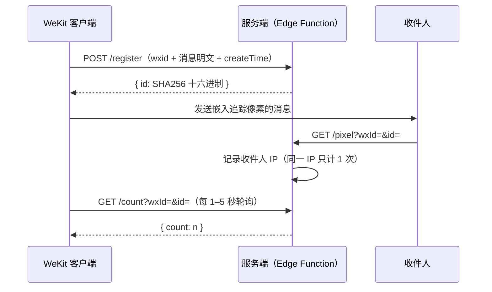

> [!IMPORTANT]
> **本仓库已归档、停止维护（2026-08），请使用新版：[lie-jiu/wekit-read-receipts-server](https://github.com/lie-jiu/wekit-read-receipts-server)。**
>
> 新版不再按平台分叉仓库：同一代码库同时支持 Bun 自建（反向代理 / 公网直连 / Cloudflare Tunnel）与 Cloudflare Workers（Durable Object 内置 SQLite）两种运行时，功能已覆盖并超出本移植版——等级权益公式、IP 定位配额、僵尸用户清理、审计日志与 `bun run manage` 运维脚本。本仓库仅作为 EdgeOne 移植方案的历史存档保留，**这里的 issue 与 PR 不再处理**。
>
> - **仍需跑在 EdgeOne 上**：请基于新版移植，平台适配层可对照本仓库与 [wekit-read-receipts-cf-workers](https://github.com/lie-jiu/wekit-read-receipts-cf-workers)（同样已归档）的 `src/backends/` 实现——新版正是把这一层抽成了统一的 SQLite 后端接口。
> - **许可已变更**：本仓库为 Apache-2.0，新版为 AGPL-3.0，二次分发前请确认差异。
> - English notice: same content at the top of [README.en.md](README.en.md).

# Read Receipts Server（EdgeOne 版）

[](LICENSE)
[](https://edgeone.ai)

**[English](README.en.md)** · 中文

基于 **EdgeOne Makers（Edge Functions + KV 存储）** 的消息已读统计服务，是
[wekit-read-receipts-cf-workers](https://github.com/lie-jiu/wekit-read-receipts-cf-workers)
（Cloudflare Workers + D1）的复刻移植版。在消息中嵌入一个 1×1 透明追踪像素，收件人打开消息时服务记录其 IP，并返回去重后的已读次数。带深色主题仪表盘、多用户数据隔离与管理员后台，接口与行为与原版保持一致。

> [!WARNING]
> **隐私提示**：本服务会在对方不知情的情况下记录收件人的 IP 地址与精确打开时间。在中国，这属于《个人信息保护法》（PIPL）的管辖范围——追踪前请告知收件人，并考虑数据最小化（用完后请在后台清空数据）。微信服务条款禁止此类第三方追踪，你的账号可能面临风险。

## 快速开始

部署步骤见[部署](#部署)。部署完成后访问你的预览 URL，注册账号即可使用；如需邀请码或管理员，见[环境变量](#环境变量)。

> [!IMPORTANT]
> Edge Functions 使用 KV 存储，**首次部署前必须在控制台申请并绑定 KV 命名空间**（见[部署](#部署)），否则接口会 500。

## 工作原理



## 功能特性

- **多用户隔离** — wxid 即账号，密码登录，每个用户只能看到自己的消息
- **等级配额** — 等级 N 保留 N 条消息 × N 个月（最大 99）；等级 0 = 拉黑，立即清空该账号数据
- **邀请码与管理员** — 可选 `INVITE_CODE` 限制注册；`ADMIN` 账号可访问 `/admin` 管理用户与数据
- **确定性 ID** — 消息 ID = `SHA256(wxId + \0 + content + \0 + createTime)`，客户端与服务端独立计算结果一致
- **IP 去重** — 同一 IP 多次打开只计 1 次已读；已读人数直接由去重标记键派生计数，与「已读详情」列表永远一致（不依赖单键计数器，避免 KV 最终一致性下的丢失更新）
- **仪表盘** — 深色主题、响应式界面，支持中英文 i18n、搜索、筛选、已读详情展开、修改密码
- **排行榜** — 仪表盘展示三张榜（注册榜 / 已读榜 / 消息榜），均可切换日榜/总榜；统计的是「累计发生过」的数据，不受等级配额清理影响，用户自行清空消息也不影响其上榜；仅显示前十，wxid 在服务端脱敏，消息榜内容同样脱敏（仅显示首尾各 2 字，不足 5 字全文显示），本人（或本人的消息）上榜高亮；日榜按中国时区（UTC+8）自然日划分；**已知限制**：短时间大量新读者并发时，统计键受 KV 读改写竞态影响可能少计（适合非实时场景，已读详情不受影响）
- **Serverless 零成本** — 运行于 EdgeOne 边缘网络，KV 免费额度 1GB

## 与 Cloudflare 原版的差异

| 项目 | 原版（CF Workers + D1） | 本版（EdgeOne Edge Functions + KV） |
|------|-------------------------|--------------------------------------|
| 数据存储 | D1（SQLite，强一致） | KV（全局变量，最终一致 ≤60s） |
| 已读计数 | D1 原子 `UPDATE ... SET count=count+1` | 由 `r_` 去重标记键派生（KV 单键计数器有丢失更新，已弃用 `rc_`） |
| 去重 | `reads(id, ip)` 唯一索引，`INSERT OR IGNORE` 原子去重 | 先查后写的去重标记，极小概率重复计数 |
| 超期已读清理 | 配额清理会按 wx_id+时间删除存活消息上的超期已读记录 | 已读标记键不含 wx_id，只能随整条消息一并清理；存活消息上的超期已读会保留（仅影响存活消息的旧已读计数，影响极小） |
| 限流 | Workers Cache API | EdgeOne Cache API（`caches.open`），同样基于边缘节点 |
| 客户端 IP | `CF-Connecting-IP` | `request.eo.clientIp` |
| 定时清理（cron） | Workers 内置 cron `0 3 * * *` | 无定时器：改为管理员手动触发 `POST /admin/cleanup` |
| 环境变量 | `wrangler` secret | 控制台环境变量（`context.env`） |
| 部署 | `npx wrangler deploy` | `edgeone makers deploy` |

## 客户端接入

本服务被 WeKit 客户端模块（第三方，不可修改）调用，它直接使用下面三个**无鉴权**端点，仅依赖「wxid 已是已注册账号」这一前置条件：

| 端点 | 用途 |
|------|------|
| `POST /register` | 发送消息时提交消息明文（wxid + content + createTime） |
| `GET /count` | 对屏幕上的每条消息每 1–5 秒轮询一次 |
| `GET /pixel` | 收件人打开消息时加载 |

请知悉：

- **邀请码只限制账号注册**（`/auth/register`），不参与消息注册。任何知道某用户 wxid 的人都能冒充该账号注册消息（受每 IP 每分钟 30 次的限流约束）
- 等级配额采用「超额删除最旧消息」的惰性清理：注册新消息或查看消息/已读次数时触发，向某 wxid 连续注册 N+1 条消息即可触发其全部消息被清除（N ≤ 99）。请仅在受信任的小圈子中使用，并善用 `ADMIN` 管理账号
- 服务端会收到消息明文（用于匹配已读记录），这是该方案的本质

## 账户与等级

- **注册**：首次使用访问登录页 → 切换到「注册」→ 填写 wxid + 密码（≥8 位）+ 邀请码 → 自动登录。也可以由管理员在 `/admin` 后台直接创建账号（wxid + 密码，默认等级 1，仅校验不重复）
- **登录**：wxid + 密码 → POST 到 `/auth/verify` → 设置 `__Host-session` cookie（HttpOnly、Secure、SameSite=Lax，30 天）→ 重定向到 `/`。管理员需手动访问 `/admin` 进入后台
- **会话**：服务端只存储会话 ID 的 SHA-256 哈希，cookie 本身从不包含密码
- **数据隔离**：所有 `/messages*`、`/reads/*` 端点强制限定为当前登录账号的 wxid；`/count`、`/register` 为公开端点，通过请求中的 wxId 参数指定账号（见[客户端接入](#客户端接入)）

### 等级配额

新注册用户为**等级 1**。等级 N 表示：最多保留 **N 条消息**，每条最多保留 **N 个月**（N 最大 99）。注册新消息或查看消息时，**超过 N 个月的旧消息无论条数多少都会被整批清理**，超出配额的最早消息也会自动删除（惰性执行）。**等级 0 = 拉黑**：禁止注册消息，且管理员将其设为 0 时立即清空该账号的全部消息与已读记录（账号保留，可随时改回）。管理员可在后台调整用户等级（0–99）。

## API 参考

> [!NOTE]
> 参数名沿用客户端约定的 `wxId`（账号格式为 `wxid_xxx`）。未注明鉴权的端点均需登录。

### 公开端点（无需登录）

| 方法 | 路径 | 说明 |
|------|------|------|
| POST | `/register` | 注册消息（wxid 必须是已注册账号），返回 `{id}` |
| GET | `/pixel?wxId=&id=` | 追踪像素（1×1 PNG），记录读者 IP（仅对已注册消息生效） |
| GET | `/count?wxId=&id=` | 消息的去重已读次数 |
| POST | `/auth/register` | 注册账号（wxid + 密码 + 邀请码） |
| POST | `/auth/verify` | wxid + 密码登录，设置会话 cookie |
| GET | `/auth/status` | 返回 `{auth_required, invite_required}` |

### 登录端点（会话 Cookie）

| 方法 | 路径 | 说明 |
|------|------|------|
| GET | `/` | 仪表盘前端（未登录显示登录页） |
| GET | `/messages?q=` | 本人的全部消息及其已读次数 |
| DELETE | `/messages` | 删除本人的全部消息与已读记录（排行榜统计保留；记录审计日志） |
| GET | `/messages/{wxId}?q=` | 按发送者列出消息（仅限本人） |
| DELETE | `/messages/{wxId}` | 删除某发送者的全部消息与已读记录（仅限本人，排行榜统计保留；记录审计日志） |
| GET | `/reads/{id}` | 本人某条消息的详细已读记录 |
| GET | `/leaderboard?scope=day\|total&metric=reg\|read\|msg` | 排行榜：`reg` 注册榜 / `read` 已读榜 / `msg` 单条消息已读榜（累计数据，前十，wxid 脱敏，`me` 标记本人；日榜按中国时区） |
| POST | `/auth/logout` | 销毁当前会话 |
| POST | `/auth/password` | 修改自己的密码 |

### 管理员端点（仅 `ADMIN` 账号）

| 方法 | 路径 | 说明 |
|------|------|------|
| GET | `/admin` | 管理后台 |
| GET | `/admin/users` | 列出所有用户 |
| POST | `/admin/users` | 创建新用户（wxId + 密码，默认等级 1，仅校验不重复） |
| POST | `/admin/level` | 调整用户等级（0–99） |
| POST | `/admin/password` | 为任意用户设置新密码 |
| DELETE | `/admin/users/{wxId}` | 删除用户及其全部数据 |
| GET | `/admin/messages` | 全量消息浏览（可按 wxId / 内容过滤） |
| DELETE | `/admin/messages?wxId=` | 删除某用户的全部数据 |
| DELETE | `/admin/messages/{id}` | 删除单条消息 |
| GET | `/admin/reads/{id}` | 任意消息的详细已读记录（管理员） |
| POST | `/admin/cleanup` | 手动清理：过期会话 + 超期审计日志（替代原版 cron 定时任务） |

## 环境变量

在 EdgeOne Makers 控制台（项目 → 环境变量）中配置（CLI 无环境变量子命令）；本地开发时在项目根目录放 `.env`（见[本地开发](#本地开发)）。

| 变量 | 必需 | 说明 |
|------|------|------|
| `INVITE_CODE` | 否 | 邀请码。配置后注册必须填写；留空则开放注册 |
| `ADMIN` | 否 | 逗号分隔的 wxid 列表，这些账号登录后可访问 `/admin` 后台。未配置则无管理员 |

## 部署

### 前置条件：申请并绑定 KV 存储

EdgeOne Makers 控制台 → **KV 存储**：

1. 点击「申请使用」（免费额度 1GB），审批通过后创建**命名空间**
2. 进入你的项目 → **KV 存储** → 将命名空间**绑定**到项目，变量名填写 `my_kv`
3. 如需 `INVITE_CODE` / `ADMIN`，在项目 → 环境变量中配置

### 部署命令

```bash
npm install -g edgeone@latest      # 需要 ≥ 1.6.0
edgeone login --site china         # 或 --site global（国内 / 国际站）
cd wekit-read-receipts-edgeone
edgeone makers deploy              # 首次部署自动创建项目并记录到 .edgeone/project.json
```

> [!NOTE]
> 在 AI/Agent 环境驱动 CLI 时，请在每条命令前加 `PAGES_SOURCE=skills`。

部署完成后返回的预览 URL 带 `?eo_token=...&eo_time=...` 鉴权参数，**完整 URL 直接访问即可**，不要截断。

> [!NOTE]
> 国内访问预览 URL 可能因备案/CDN 策略受限（如 401）。如需长期稳定公开访问，请绑定已备案的自定义域名。

### 本地开发

```bash
PAGES_SOURCE=skills edgeone makers dev     # http://127.0.0.1:8088/
```

将 `.env.example` 复制为 `.env` 可注入本地环境变量（`ADMIN`、`INVITE_CODE`）。

### 定时清理

原版依赖 Workers cron 每天清理过期会话与超期审计日志。EdgeOne Edge Functions 无定时器，请定期调用 `POST /admin/cleanup`（管理员），或从外部 cron（如 GitHub Actions）定时请求该接口。

### 清空数据

> [!IMPORTANT]
> 需要清空数据时，在控制台 KV 存储中**清空该命名空间的全部键值**即可（键前缀：`u_` 用户、`m_` 消息、`r_` 已读、`s_` 会话、`a_` 审计、`gs_`/`rs_`/`ms_` 统计）。不要删除命名空间本身，否则项目绑定会失效。

## 安全设计

- **速率限制** — `/pixel`：每 IP 每分钟 10 次；`/register`（消息）：每 IP 每分钟 30 次（fail-open，不影响客户端）；`/auth/verify`、`/auth/register`、`/auth/password`：每 IP 每分钟 5 次（fail-closed）
- **密码哈希** — PBKDF2-SHA256，每用户随机 salt，10 万次迭代（Web Crypto）
- **已注册消息校验** — `/pixel` 忽略未注册消息的读取（阻止灌库攻击）
- **去重** — 已读标记键 `r_{id}_{ip哈希}` 保证同 IP 同消息只计 1 次
- **恒定时间密码比较** — 通过 SHA-256 摘要比较；登录失败附加随机延迟
- **会话 cookie** — 随机 ID、静态哈希、30 天有效期、`__Host-` 前缀、Secure/HttpOnly/SameSite=Lax
- **仅信任客户端 IP** — 只读取 `request.eo.clientIp`，忽略客户端可控的请求头
- **安全响应头** — 所有响应均携带 CSP、`X-Content-Type-Options`、`X-Frame-Options`、`Referrer-Policy`
- **输入校验** — 注册字段长度限制、消息内容 ≤10000 字符、wxid 格式校验、畸形像素 URL 兜底解析
- **审计日志** — 每次批量/按发送者删除都会记录（自动保留 30 天，由 `/admin/cleanup` 清理）

## 项目结构

```
├── edge-functions/
│   ├── index.js               # GET /：登录页 / 仪表盘
│   ├── pixel.js               # GET /pixel：追踪像素
│   ├── register.js            # POST /register：注册消息（客户端 API）
│   ├── count.js               # GET /count：已读次数
│   ├── leaderboard.js         # GET /leaderboard：排行榜
│   ├── auth/                  # 会话端点（register / verify / logout / password / status）
│   ├── messages/              # 本人消息列表与删除
│   ├── reads/                 # 本人消息的已读详情
│   ├── admin/                 # 管理员后台与接口（含手动清理）
│   ├── [[default]].js         # 兜底路由（favicon / 404）
│   └── _lib/                  # 共享模块
│       ├── config.js          # 常量与安全头 / CSP
│       ├── util.js            # 密码哈希、限流、响应封装、脱敏
│       ├── store.js           # KV 数据层（键设计、配额、排行榜、清理）
│       ├── session.js         # 会话解析、Cookie、管理员判断
│       ├── png.js             # 追踪像素（1×1 PNG）
│       └── pages/             # 前端页面模板（login / dashboard / admin）
├── .env.example               # 环境变量模板
├── package.json
└── LICENSE
```

## 技术栈

- **运行时：** EdgeOne Makers Edge Functions（V8）
- **存储：** EdgeOne KV Storage（全局变量 `my_kv`）
- **前端：** 原生 HTML/CSS/JS，无构建步骤，无依赖
- **哈希：** Web Crypto API（SHA-256 / PBKDF2）
- **速率限制：** Cache API（固定窗口）

## 许可证

Apache-2.0
